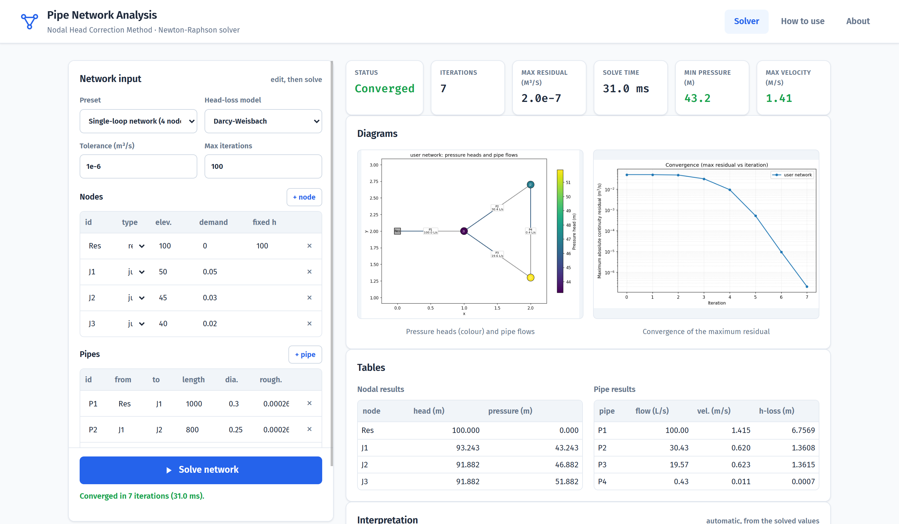
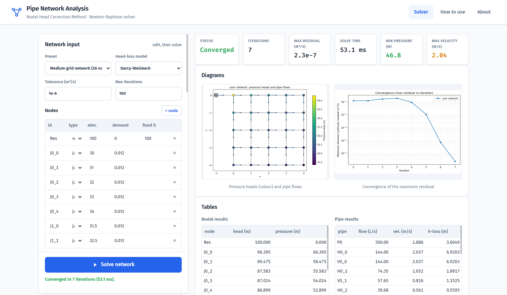
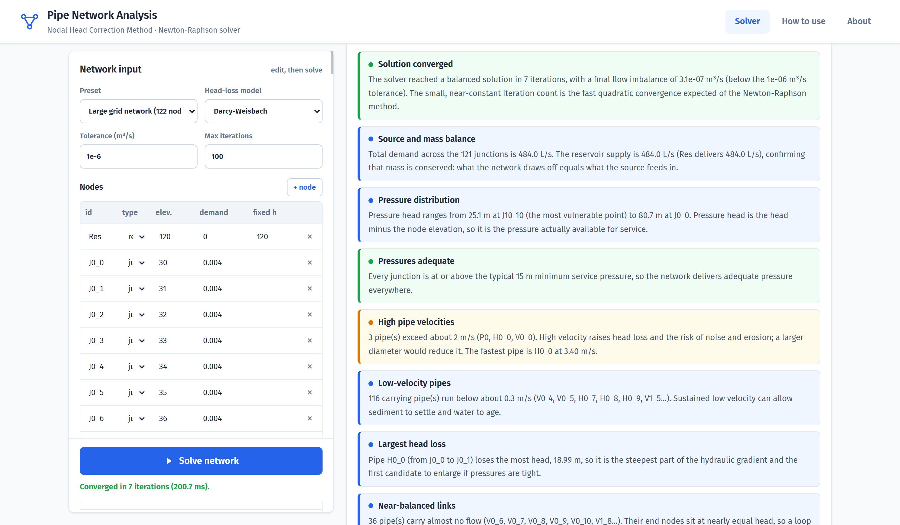
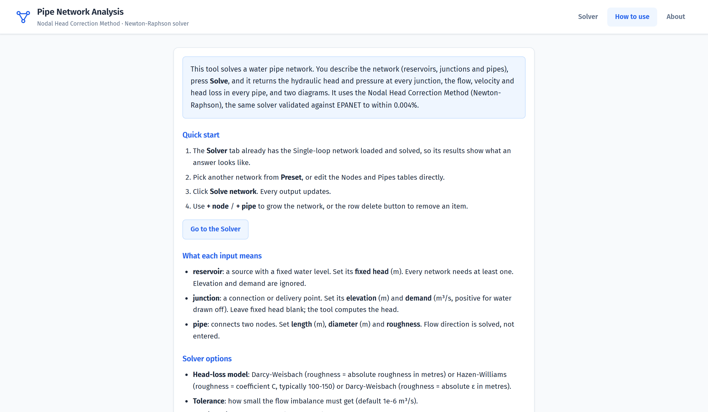
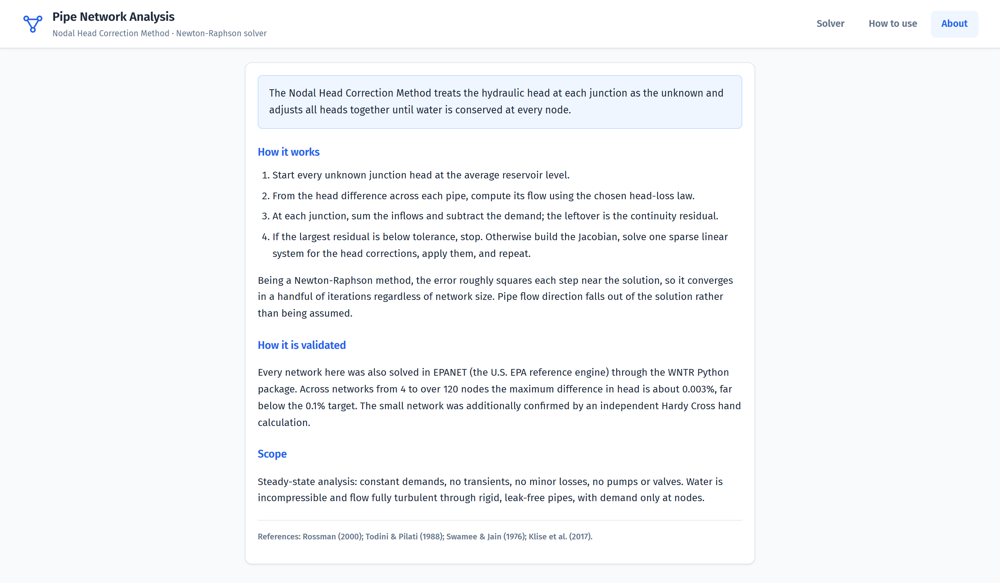
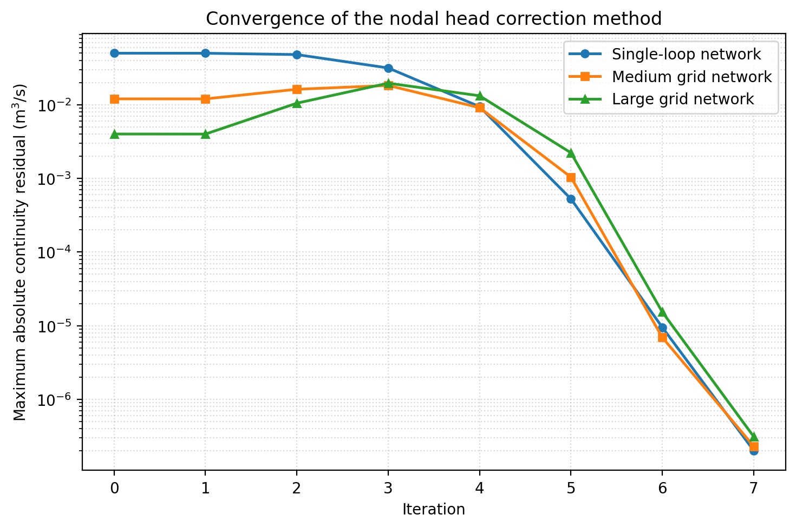
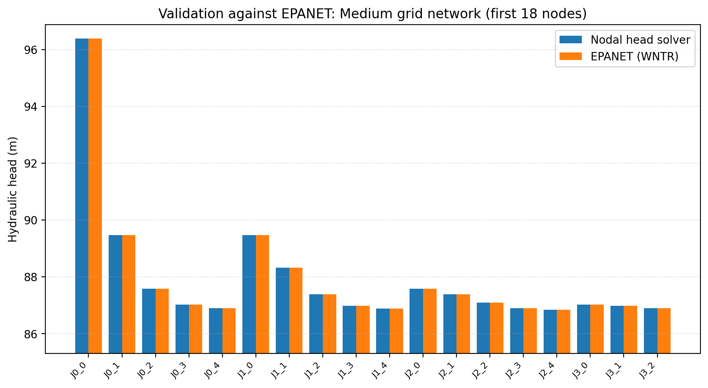

# Pipe Network Analysis — Nodal Head Correction Method

A steady-state water distribution network solver, validated against EPANET, with
an interactive Flask web application.

The solver treats the junction heads as the unknowns and solves nodal continuity
by Newton-Raphson, assembling a sparse Jacobian and solving each step with
`scipy.sparse.linalg.spsolve` (SuperLU). Head loss can be modelled by
Darcy-Weisbach (friction factor from Swamee-Jain, recomputed every iteration) or
Hazen-Williams. It converges in a handful of iterations regardless of network
size, and pipe flow directions fall out of the solution rather than being assumed.



## Screenshots

| Medium grid network (26 nodes) | Automatic interpretation (122-node grid) |
|---|---|
|  |  |

| How to use | About |
|---|---|
|  |  |

## Highlights

- **One solver, used everywhere.** The validation scripts, the figures and the web
  app all import the same `solver/` package. None of them re-implements the algorithm.
- **Validated against EPANET.** Every test network is rebuilt in EPANET through
  [WNTR](https://github.com/USEPA/WNTR) and compared node by node and pipe by pipe.
  The maximum head error across all networks is about **0.003%**, well under a
  0.1% acceptance target.
- **Independent hand check.** The small network is also solved by the classic
  Hardy Cross loop method; the two methods agree to within 0.0002 L/s.
- **Scales.** Tested on networks from 4 to 122 nodes (220 pipes).

| Convergence | Validation vs EPANET |
|---|---|
|  |  |

## Repository layout

```
solver/                  the solver package
  network.py             Node, Pipe, Network data structures + validation
  headloss.py            Hazen-Williams and Darcy-Weisbach (Swamee-Jain) models
  core.py                the Newton-Raphson nodal head correction algorithm
  networks.py            the three test networks
  interpret.py           plain-language interpretation of results
  serialize.py           JSON <-> Network conversion for the web app
plotting.py              shared figure code (used by the scripts AND the web app)
analysis.py              runs solver + EPANET on all networks, caches results.json
validation/
  epanet_bridge.py       reproduces a network in EPANET via WNTR
  validate.py            prints comparison tables and the maximum % error
  hand_check.py          independent Hardy Cross check of the small network
scripts/
  generate_figures.py    regenerates the PNG figures in figures/
  capture_app_figures.py captures real web-app output for the README
app/                     Flask web application
figures/                 generated PNG figures
results/results.json     cached numerical results (regenerated on demand)
```

Run every command from the repository root so that `solver/`, `analysis.py` and
`plotting.py` are importable.

## Quick start

```bash
pip install -r requirements.txt

# validate the solver against EPANET (prints the maximum % error)
python -m validation.validate

# independent hand check of the small network (Hardy Cross)
python -m validation.hand_check

# regenerate results and figures
python analysis.py
python -m scripts.generate_figures

# run the web application
python app/app.py            # then open http://127.0.0.1:5000
# or, with the production server (Linux/macOS):
gunicorn app.app:app
```

The web page loads with the single-loop network already solved. Edit any node or
pipe, choose a head-loss model, set the tolerance and iteration limit, and click
**Solve network**; every table and both diagrams update. A preset selector loads
the three test networks.

## Test networks

| Network | Nodes | Pipes | Purpose |
|---|---|---|---|
| Single-loop | 4 | 4 | small enough to check by hand |
| Medium grid | 26 | 40 | highly meshed multi-loop behaviour |
| Large grid | 122 | 220 | performance and scalability |

## Scope

Steady-state analysis only: constant demands, no transients, no minor losses, no
pumps or valves. Water is incompressible and pipes are rigid and leak-free.

## Deploying on Render

`render.yaml` is included, so Render can configure the service as a Blueprint.
To set it up manually, create a **Web Service** with build command
`pip install -r requirements.txt` and start command `gunicorn app.app:app`.

## References

- Rossman, L. A. (2000). *EPANET 2: Users manual*. U.S. Environmental
  Protection Agency.
- Klise, K. A., Bynum, M., Moriarty, D., & Murray, R. (2017). A software
  framework for assessing the resilience of drinking water systems to
  disasters with an example earthquake case study. *Environmental Modelling &
  Software, 95*, 420-431.
- Swamee, P. K., & Jain, A. K. (1976). Explicit equations for pipe-flow
  problems. *Journal of the Hydraulics Division, 102*(5), 657-664.
